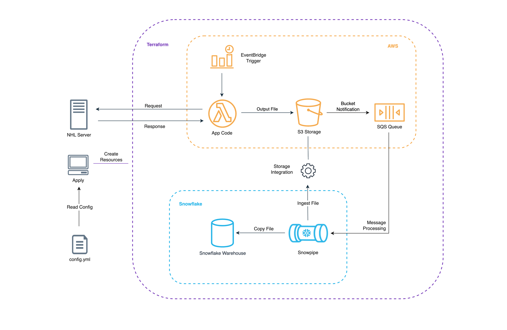

# NHL-Analytics

## Description
This project is an end-to-end data pipeline that extracts data from the NHL API and loads it into Snowflake for analysis. There are a few simple commands that allow engineers to get up and running very quickly. This project can also be easily extended to add aditional loaders by updating `config.yml`. 

## Motivation
When someone first embrarks on their Analytics Engineering journey they typically start with [dbt](https://www.getdbt.com/). In many cases, dbt is the front door into the exciting world of the modern data stack. While dbt is a fantastic transformation tool, it won't help at all with data ingestion. This leads aspiring analytics engineers down a learning rabbit hole trying to answer questions like:
 - How do I get data into my data warehouse to transform with dbt?
 - Now that I have data in my data warehouse, how can I ensure that it stays fresh?
 - How can I update my data each hour, day, minute without leaving my computer open?


 These are all questions that I hope this project can answer (or at least prolong) by providing a simple framework for ingesting data into Snowflake via Python application code.


## Architecture
Below is a diagram showing the high-level architecture for this project:




On your machine, when you run `make apply` terraform will read `config.yml` to understand what resources to spin-up. Once the resources are created with all of the proper permissions configured, you can head to the AWS Lambda console to test the function. 


## Technologies Used
- Terraform - Infrastructure
- AWS Lambda - Data Processing
- AWS S3 - Staging
- Snowflake - Warehouse
- Python - Application Code

&nbsp;

## Prerequisites
To get up and running with this project:
1. Create an [AWS](https://aws.amazon.com/) account and install the AWS CLI
2. Create a [Snowflake](https://www.snowflake.com/) Account
3. Install [Terraform](https://developer.hashicorp.com/terraform/downloads)
4. Install Python 3.7+


## Setup
1. Clone the repo to your local machine and change into the repo directory

2. Initialize terraform: 
```sh
$ make init
```
This make command will execute a handful of shell commands and should only be run once when the project is initialized. These commands will output:
- A virtual environment called `venv` in the project's root directory. This virtual environment will install the `requirements.txt` file in the project's root directory as well as upgrade the pip package manager.
- A file called `terraform/terraform.tfvars`. This file is used for environment variables that will be made available to terraform when creating our resources. You will need to enter the values shown below (with exception of python_version which is automatically detected when `make init` is run):
```sh
#Python
python_version = <Automatically detected>

#AWS
aws_access_key = 
aws_secret_key = 
aws_region     = 

#Snowflake
snowflake_user     = 
snowflake_password = 
snowflake_region   = 
snowflake_account  = 
```


3. Activate the virtual environment created by the `make init` step. This follows the `venv` naming convenvtion:
```sh
$ source venv/bin/activate
```
There are some dependencies for the null_resources using a local-exec provisioner so we need to make sure we're using the `venv` that comes pre-installed with those packages.

4. Run the apply command to spin up the application infrastructure: 
```sh
$ make apply
```
